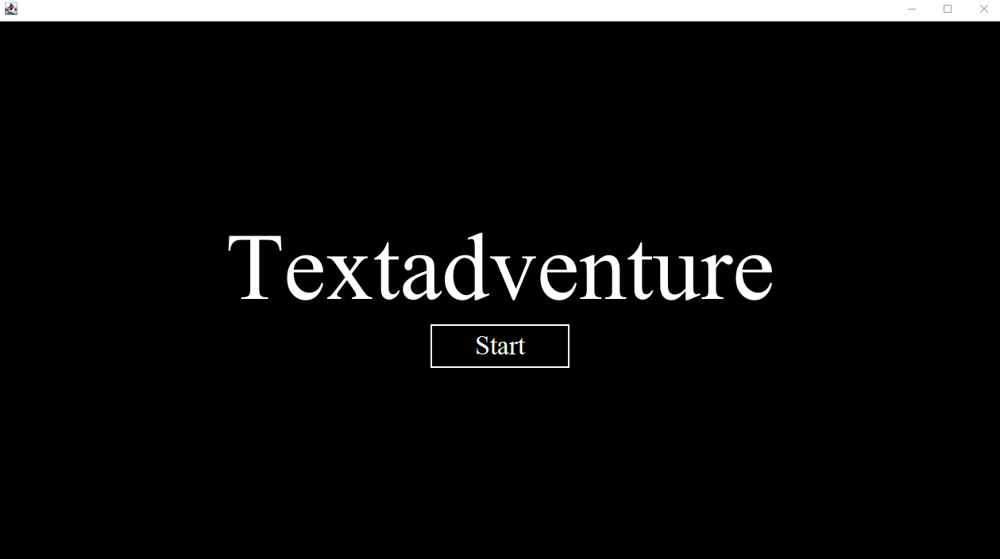
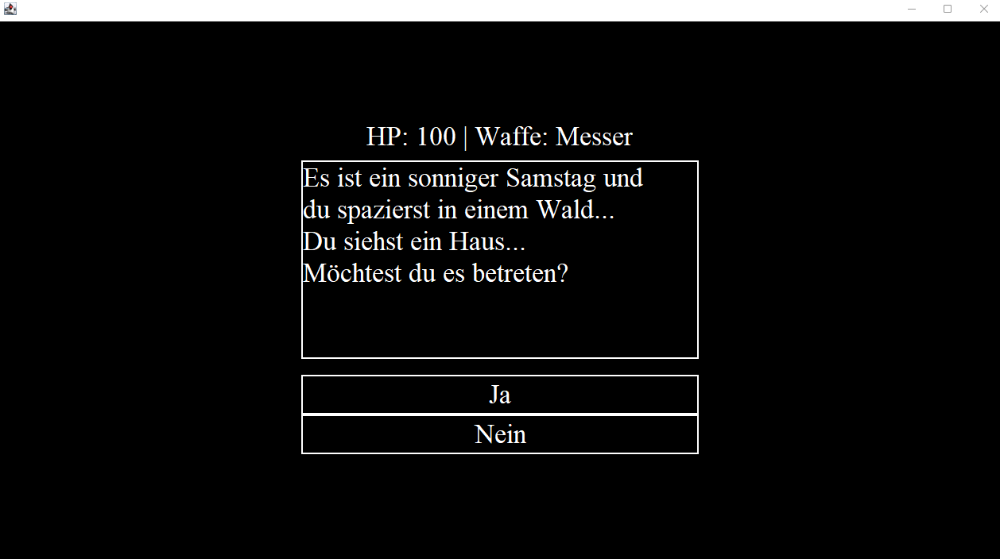

# Textadventure
Ein Textadventure mit einer GUI und Buttons, anstatt eines Eingabefeldes. Die Story ist noch nicht ganz zu Ende, da es für 
mich bei diesem Projekt eher um Layouts ging. Die GUI ist komplett resizable und ein Loop im Hintergrund prüft, ob das 
Fenster resized wurde und wenn wie groß es nun ist, um die Schriftgröße der Fenstergröße anzupassen. Das ist das Startmenü:

Und hier ist das Spiel. Die Buttons repräsentieren die Antwortmöglichkeiten und die Textarea erzählt die Geschichte. Das JLabel bei dem die HP und die Art der Waffe steht, ist noch unbenutzt.

